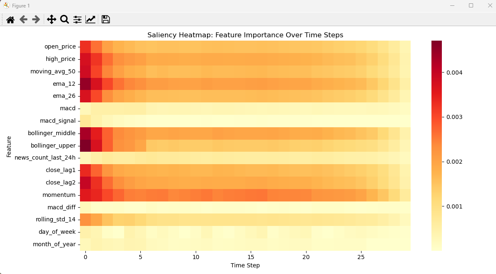
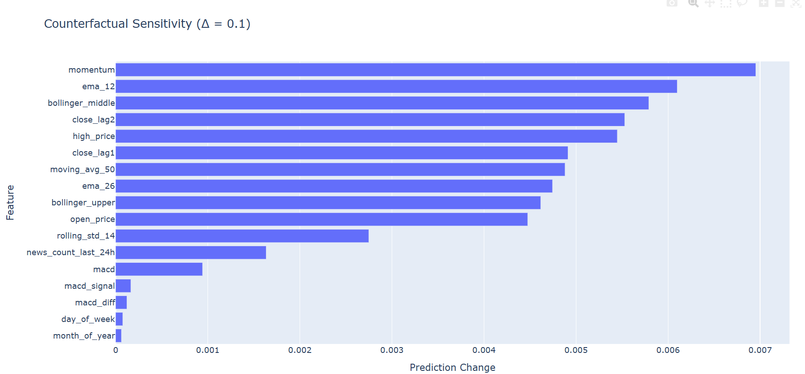

## 📈 SHAP (SHapley Additive exPlanations)

- SHAP assigns each feature an importance value for a particular prediction based on game theory.
- It explains the impact of each feature by comparing the prediction with and without that feature.
- The SHAP bar plot shows **mean absolute impact** of each feature across all test samples.
- Useful for **global interpretability** and **model-agnostic explanation**.
- Helps identify features with **consistent influence** on predictions.

---

## 🌿 LIME (Local Interpretable Model-agnostic Explanations)

- LIME creates simple, interpretable models (like linear models) around individual predictions.
- It perturbs the input and observes how predictions change to estimate feature importance.
- Best for understanding **single prediction explanations**.
- The output lists top influential feature-timestep combinations.
- Works well when used with tabular, text, or image models.

---

## Saliency in Time Series Forecasting

**Saliency** helps us visualize **which parts of the input data the model "attends" to most** when making predictions. It does this by computing the gradient of the output prediction with respect to the input — **highlighting important features and time steps**.

---

### 📊 Saliency Heatmap Interpretation

### 🔍 Key Insights:

1. **🕒 X-Axis = Time Steps (0–29):**  
   - Each column represents a timestep in your sequence.  
   - Time step 29 is the most recent, 0 is the farthest in the past.

2. **🧾 Y-Axis = Features:**  
   - Real input features used in your model (e.g., `open_price`, `ema_12`, `momentum`, etc.)

3. **🎨 Color Intensity = Gradient Magnitude (Importance):**  
   - Darker/Redder cells = Higher importance (model relied more on that feature at that timestep).  
   - Lighter/Yellowish cells = Less important.

4. **🔥 Most Influential Features:**  
   - `bollinger_middle`, `bollinger_upper`, `ema_12`, `momentum`, `close_lag1` show **strong gradient response**, indicating they heavily influence the prediction.

5. **🧊 Least Influential Features:**  
   - `macd`, `macd_diff`, `month_of_year`, and `day_of_week` have consistently **low impact** — you may consider simplifying or dropping these.

6. **📉 Feature Importance Over Time:**  
   - Features are not equally important across all time steps.  
   - Some features (like `momentum`) maintain influence across time, while others fade quickly.

### ✅ Why Saliency Matters

- Helps explain model behavior in **sequence models (like LSTM)**.  
- Highlights **which features and time steps** drive predictions.  
- Useful for **feature selection**, **model debugging**, and building **trust in AI models**.

## 🔍 Counterfactual Sensitivity Analysis

Counterfactual explanations measure how much the model's prediction changes when you make small tweaks to individual features. This is useful to:

- Understand **which features the model is most sensitive to**
- Detect **non-linear effects** of features
- Reveal **local behavior** of complex models like LSTMs

### 📈 Plot Explanation

The bar chart shows the **prediction change** after increasing each feature by `Δ = 0.1`, one at a time.

- Features like `momentum`, `ema_12`, and `bollinger_middle` cause the **highest shift** in prediction → these are **high impact features**
- Lower bars (e.g., `macd_diff`, `day_of_week`) imply these features are **less influential**
- Sensitivity ≠ importance always, but it gives insight into **model responsiveness**

### ✅ Use Cases

- Identify **leverage features** for decision control
- Communicate model behavior to non-technical stakeholders
- Debug unstable or overly sensitive predictions
